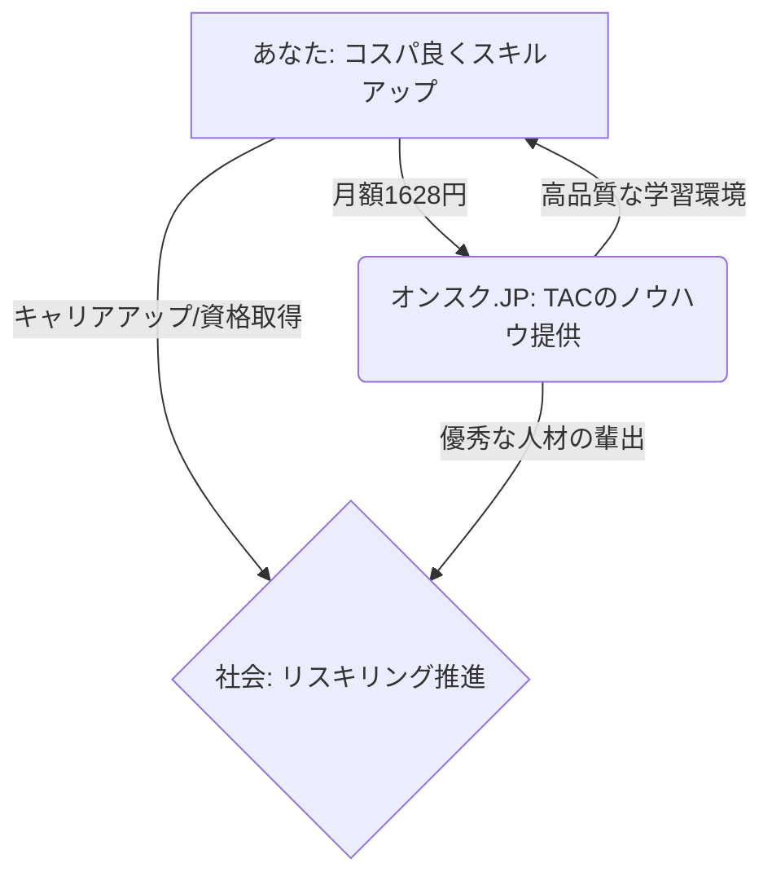
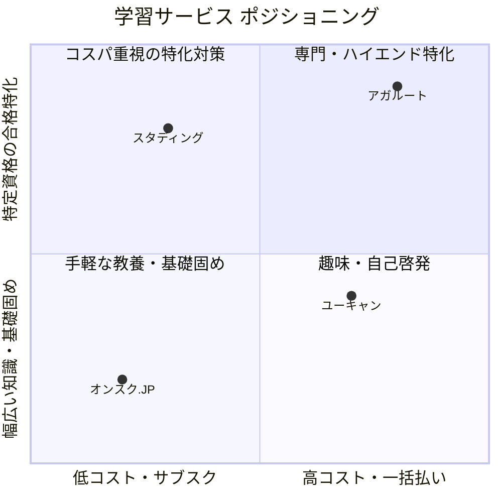

# 【オンスク.JPレビュー】月額1,078円から始める、失敗しない大人の学び直し

「毎日忙しくて勉強時間が取れない…」
「資格を取りたいけれど、高いスクール代を払って挫折するのが怖い…」

そんな悩みをお持ちではありませんか？
今回は、月額定額で資格学習が受け放題になる「オンスク.JP」について、キャリアの選択肢を広げるための賢い活用法を解説します。実は、いきなり高いプランに申し込む必要はありません。無理なく始められる方法をお伝えします。

## 1. 読者も企業も社会も嬉しい「三方良し」の仕組み

オンスク.JPが画期的なのは、関わる全ての人にメリットがある「三方良し」のビジネスモデルを実現している点です。

- **あなた（買い手）:** 圧倒的な低コストで60以上の講座が学び放題。1回約5分の動画で隙間時間に学習できるため、挫折しにくい環境が手に入ります。
- **企業（売り手）:** 資格の学校TACグループのノウハウを、オンラインを通じて広く多くの人に提供できます。
- **社会（世間）:** 手軽なリスキリングによって社会全体の生産性が向上し、より良いキャリアの流動化が促進されます。

## 2. 圧倒的な投資対効果（ROI）

学習サービスを選ぶ際、重要なのは「投資対効果（ROI）」です。オンスク.JPはこのROIが非常に優れています。

- **時間的ROI:** 1回約10分の動画学習で、通勤や昼休みの「死に時間」を「自己投資」の時間へと変換できます。
- **金銭的ROI:** 月額1,628円（スタンダードプラン）は、ビジネス書1冊分、またはランチ1〜2回分の価格です。これで資格を取得し、月給が数千円アップ（資格手当など）すれば、初月で十分に回収可能です。数十万円のスクール代が不要になる圧倒的なコスパを誇ります。

## 3. 競合比較とオンスク.JPの立ち位置

スタディングやユーキャンなど、特定の資格に特化した「買い切り型」のスクールとは役割が異なります。

オンスク.JPは「広く浅く」「学習のエンジン・基礎固め」に最適です。「本当にその資格が自分に向いているか？」を確認するための、本格的な学習前の「適性テスト」としても非常に優秀なサービスです。

## 4. あえておすすめする「ライトプラン」と無料体験

ここまでスタンダードプラン（月額1,628円）を基準にお話ししてきましたが、実は**「いきなり1,628円を払うのが不安」という方にこそ、あえて下位プランである「ライトプラン（月額1,078円）」をおすすめします。**

ライトプランは音声ダウンロード等の機能が一部省かれていますが、動画講義の視聴や問題演習といった基本的な学習機能は十分に備わっています。まずはこのライトプランで「学習を継続できるか」を試してみてください。私たちは、あなたが無駄なお金を使って挫折してしまうことを最も避けたいと考えています。

さらに、課金前に講義の質やシステムを試せる「無料体験」も用意されています。まずは無料で「お試し」して、リスクゼロでスタートするのが最も賢い選択です。

## 5. 今日の帰り道から、新しいキャリアを始めませんか？

「いつかやろう」は、いつまでも実現しません。
今日の「帰りの電車」から、あなたのキャリアアップを始めませんか？

無料体験の登録ステップは最短3分で完了します。

まずは無料体験で、あなたの可能性を広げる第一歩を踏み出してみてください。

---

  
👉 <b><a href="https://px.a8.net/svt/ejp?a8mat=4BCDBN+1JYXTE+408S+60H7M" rel="nofollow">スキマ時間を有効活用できる【オンスク.JP】</a></b>

